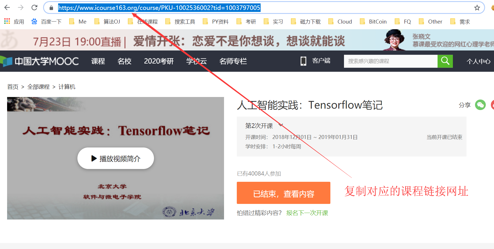
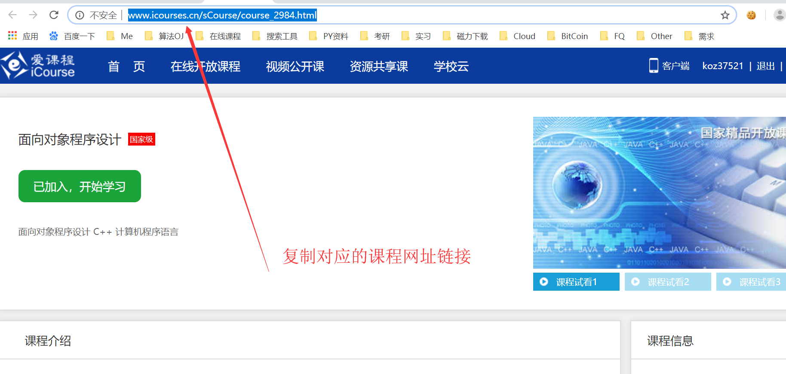
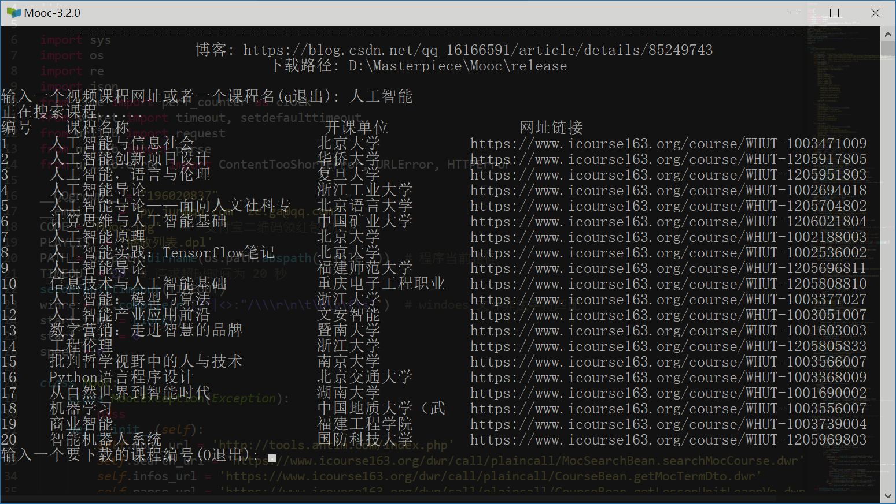
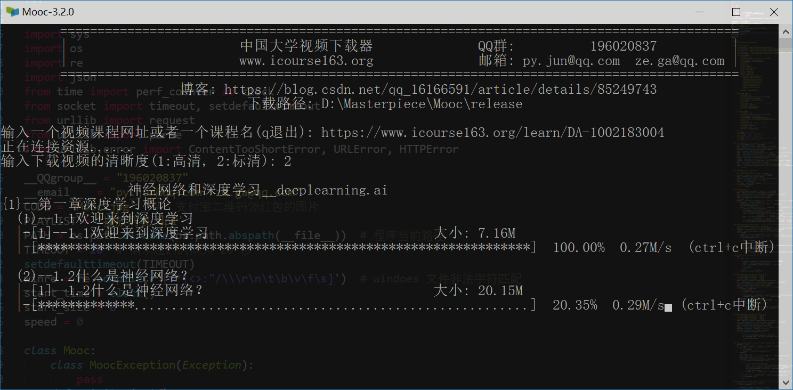

### 慕课下载器帮助文档

#### 一.  软件下载：

------

1. [Github Releases](https://github.com/PyJun/Mooc_Downloader/releases)
2. [百度云链接](https://pan.baidu.com/s/1yxM_AnVs8r-7sYaGixEptQ)

#### 二. 使用说明

------

##### 1.从中国大学官网 **icourse163.org** 或者爱课程官网 **icourses.cn**下选择任意一个课程复制其网址，如下图：

##### 2.然后粘贴到 Mooc.exe 的程序中，并按要求输入指令，会自动下载相应课程的视频和课件，如下图：

#### 三.常见问题

------

##### 1.Mooc下载器支持哪些网站的视频下载？

答：目前已支持中国大学慕课和爱课程的所有免费视频课程下载，官方网址如下：

1. [中国大学慕课官网](https://www.icourse163.org/)
2. [爱课程官网](http://www.icourses.cn)

有关更多慕课网站的课程下载，敬请期待

##### 2.关于课程还未开课无法下载， 或者正在开课无法下载全部课程问题？

答：若课程有前几次开课，选择图片的版本一般选择最近一次的开课，然后复制链接进行下载。
PS：关于每次开课内容一般大致相同，新课程可能会有少量更新等。一般不会影响学习。

------

##### 3.是否可以下载已经结束的课程？

答：丝毫没影响，依然可以下载，直接复制链接到下载器中下载即可

##### 4.收费视频可以下载吗？

答：因为版权问题，收费视频该软件不提供下载

##### 5. “播放列表.dpl” 文件有什么用？

答：电脑下载安装 **Potplayer** 播放器后，然后右键用potplayer打开“播放列表.dpl”文件，

即可顺序播放器所有视频，可以更方便的观看

##### 6.“修复播放列表.bat” 文件有什么用？

答：当你手动把整个课程目录拷贝到其它地方后，你会发现 “播放列表.dpl”文件会失效，这时可以通过双击“修复播放列表.bat”文件来修复它。

##### 7.软件出现请求异常和下载异常的问题？

答：一般情况是你的本地网络出现的问题，请检查网络是否正常连接。如果确认网络良好还是出现了这样的问题，那么欢迎反馈给我们

##### 8.该软件开源了吗？

答：软件所有源代码已经上传至 GitHub

项目地址：**https://github.com/PyJun/Mooc_Downloader**

作者邮箱：**py.jun@qq.com**

